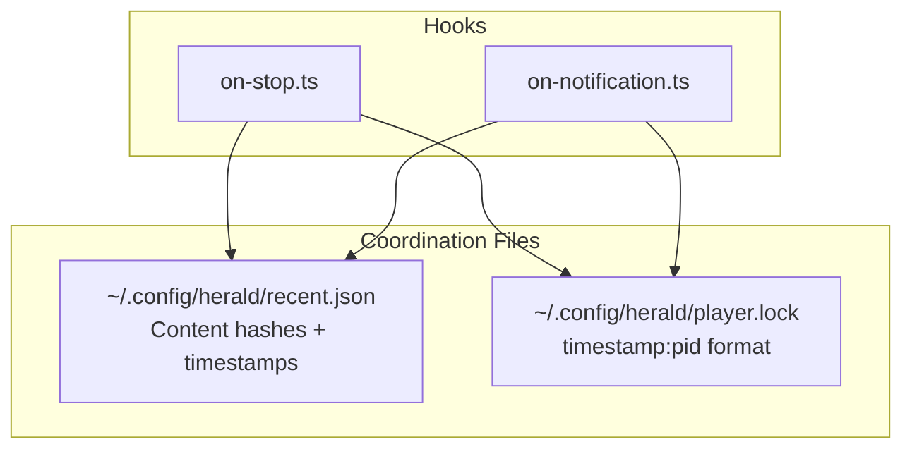
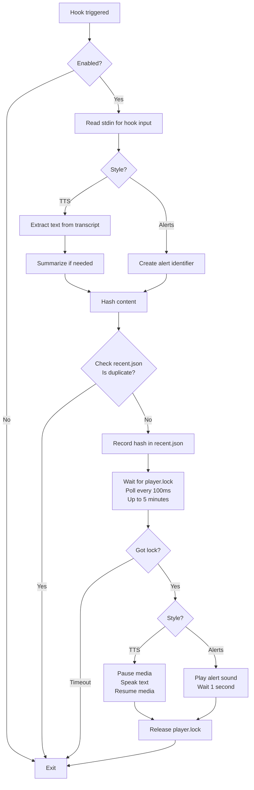
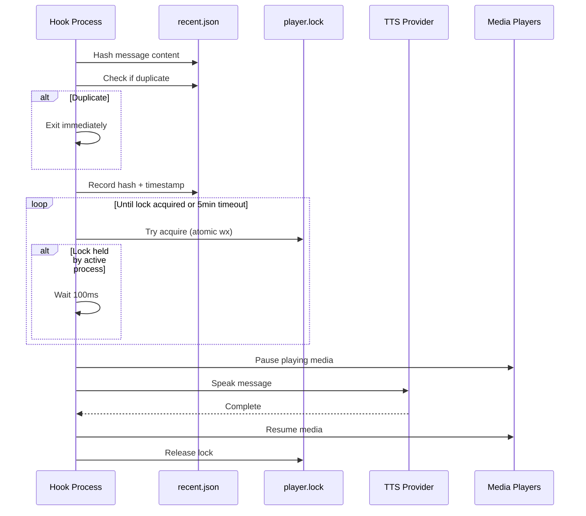
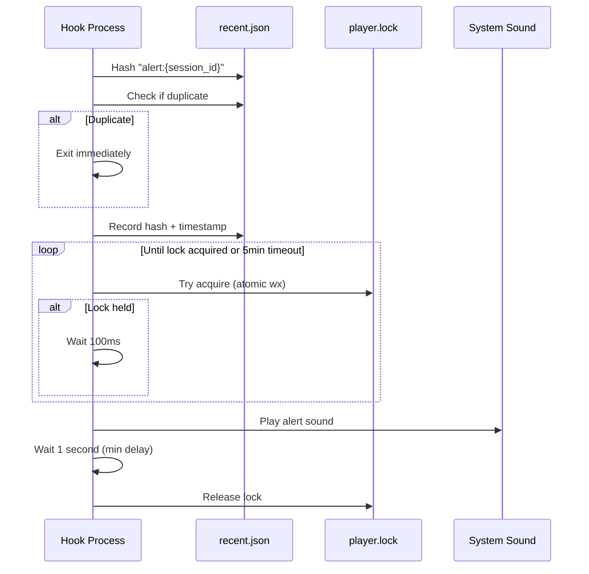
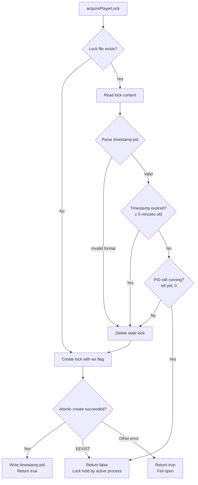
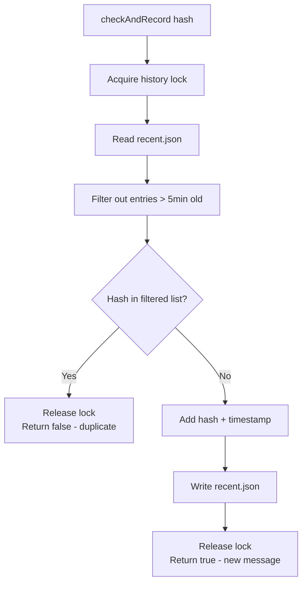
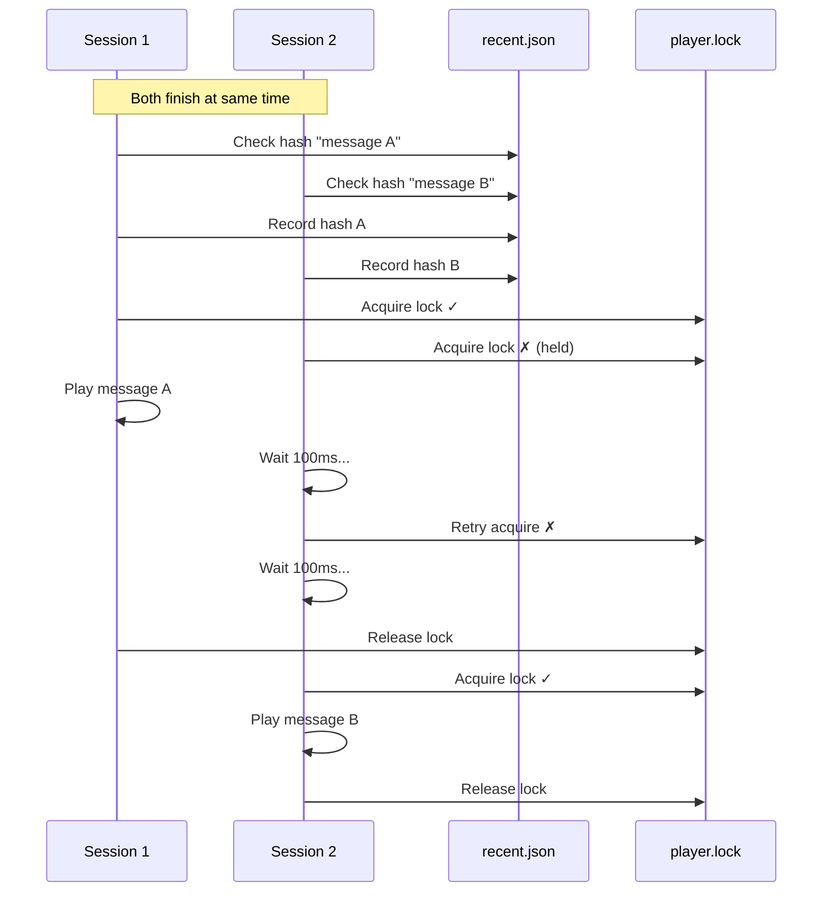
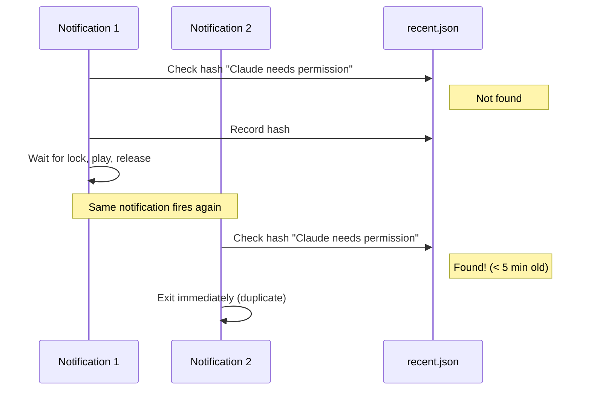
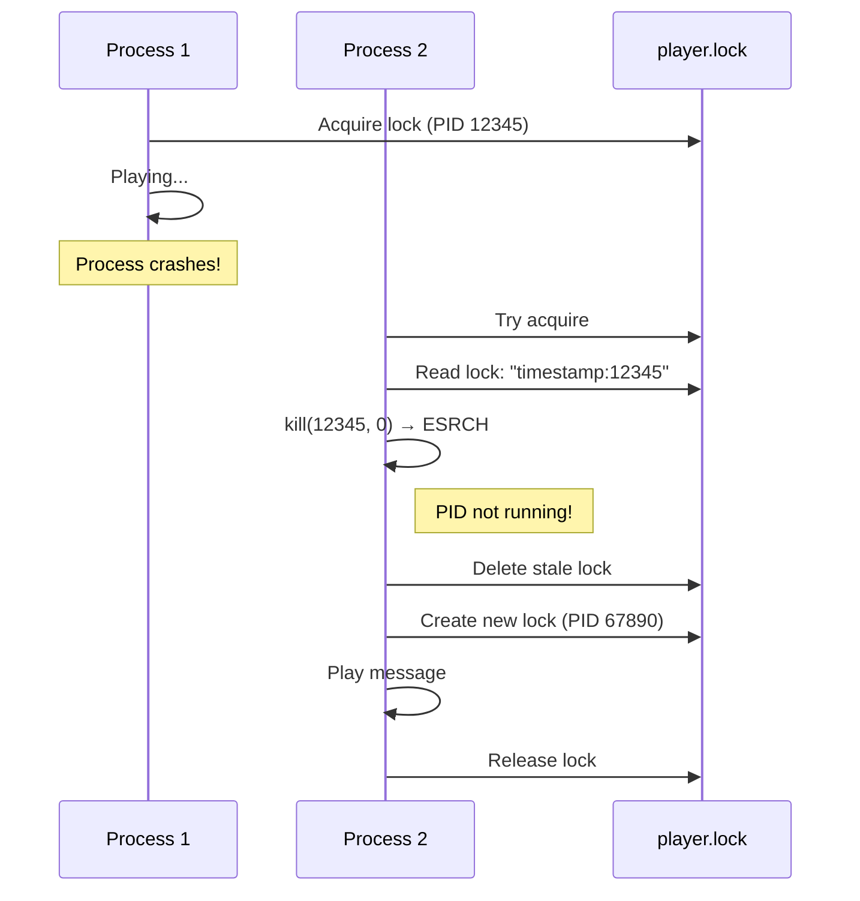

# Playback Control System

This document describes how Herald prevents duplicate plays and coordinates multiple simultaneous notifications.

## Overview

Herald uses a **wait-and-play** pattern with two key mechanisms:

1. **Deduplication** - Recent plays are tracked by content hash to prevent the same message from playing twice within 5 minutes
2. **Player Lock** - Only one process can play audio at a time; others wait their turn

## Architecture



### Files

| File | Purpose | Format |
|------|---------|--------|
| `recent.json` | Tracks recently played content hashes (max 10 entries) | `[{hash, timestamp}, ...]` |
| `player.lock` | Ensures single player at a time | `{timestamp}:{pid}` |

## Stop Hook Flow

The stop hook fires when Claude finishes a task. It plays either TTS (text-to-speech) or an alert sound.



### Stop Hook: TTS Mode



### Stop Hook: Alert Mode



## Notification Hook Flow

The notification hook fires when Claude needs user attention (permission prompts, questions, etc.).

```mermaid
flowchart TD
    A[Hook triggered] --> B{Enabled?}
    B -->|No| Z[Exit]
    B -->|Yes| C[Read stdin for hook input]

    C --> D{Valid notification type?}
    D -->|No| Z
    D -->|Yes| E{Style?}

    E -->|TTS| F[Set message based on type:<br/>• permission_prompt → 'Claude needs permission'<br/>• elicitation_dialog → 'Claude needs more info'<br/>• default → 'Claude is waiting']
    E -->|Alerts| G[Create ping identifier:<br/>ping:{type}:{session_id}]

    F --> H[Hash content]
    G --> H

    H --> I{Check recent.json<br/>Is duplicate?}
    I -->|Yes| Z
    I -->|No| J[Record hash in recent.json]

    J --> K[Wait for player.lock<br/>Poll every 100ms<br/>Up to 5 minutes]

    K --> L{Got lock?}
    L -->|Timeout| Z
    L -->|Yes| M{Style?}

    M -->|TTS| N[Pause media<br/>Speak message<br/>Resume media]
    M -->|Alerts| O[Play ping sound<br/>Wait 1 second]

    N --> P[Release player.lock]
    O --> P
    P --> Z
```

## Player Lock Details

The player lock ensures only one process plays audio at a time.



### Stale Lock Detection

A lock is considered stale if:
- Timestamp is ≥ 5 minutes old, OR
- The PID in the lock file is no longer running

This handles crashed processes without waiting for timeout.

## Deduplication Details

Content is deduplicated using SHA256 hashes (first 16 chars).



### Hash Examples

| Content | Hash (16 chars) |
|---------|-----------------|
| "Done" | `a3f2b8c1d4e5f6a7` |
| "Claude needs permission" | `b7c8d9e0f1a2b3c4` |
| "alert:abc123-session-id" | `c4d5e6f7a8b9c0d1` |
| "ping:permission_prompt:abc123" | `d5e6f7a8b9c0d1e2` |

## Timing Guarantees

| Scenario | Behavior |
|----------|----------|
| Same message within 5 min | Blocked (duplicate hash) |
| Same message after 5 min | Allowed (hash expired) |
| Different messages simultaneously | Each waits its turn, plays in sequence |
| Alerts in rapid succession | 1 second minimum gap |
| Pings in rapid succession | 1 second minimum gap |
| Process waiting for lock | Times out after 5 minutes |
| Process crashes while holding lock | Detected via PID check |
| History file size | Automatically trimmed to last 10 entries |

## Example Scenarios

### Scenario 1: Two Claude sessions finish simultaneously



### Scenario 2: Duplicate notification blocked



### Scenario 3: Crashed process recovery


